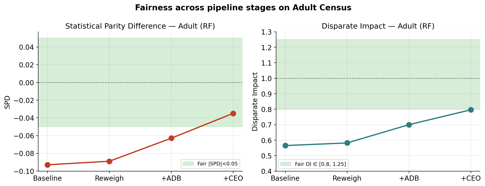
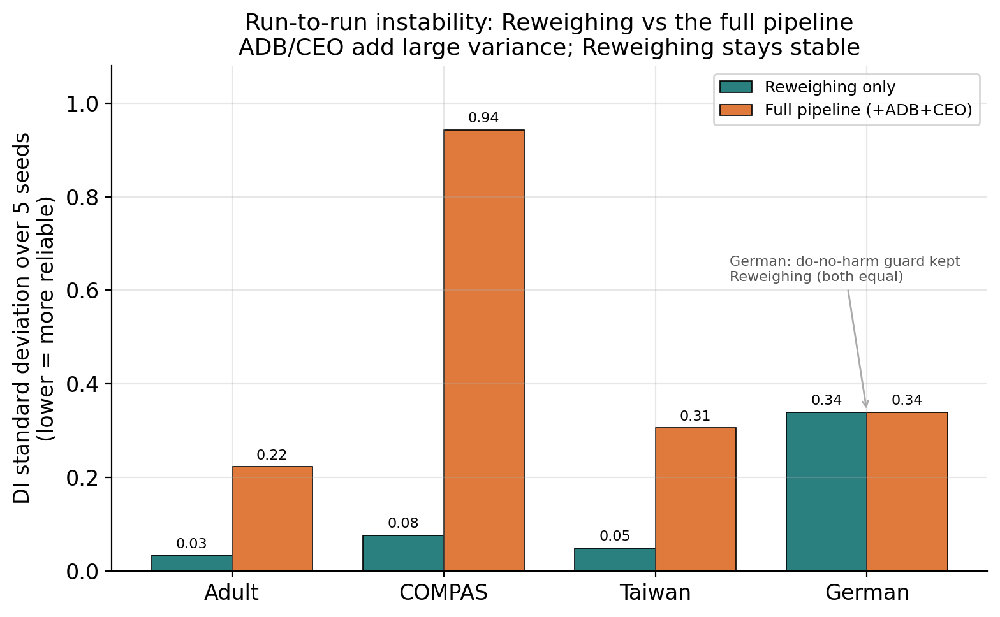
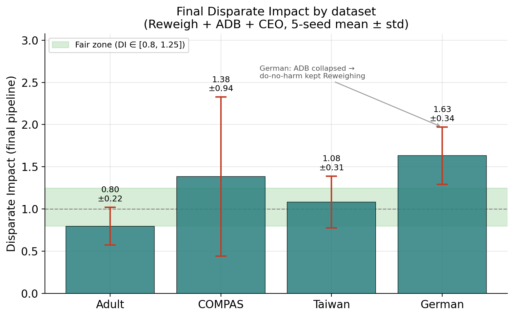

# A Reproducible Replication and Critical Analysis of a Three-Stage Bias-Mitigation Framework for AI Systems

---

## Abstract

Machine-learning systems increasingly drive high-stakes decisions in finance,
healthcare and criminal justice, where biased predictions can entrench social
inequality. IBM's AI Fairness 360 (AIF360) toolkit and the framework of
Loganathan et al. (2025) — combining **Reweighing** (pre-processing),
**Adversarial Debiasing / ADB** (in-processing) and **Calibrated Equalised Odds /
CEO** (post-processing) — are widely cited as a way to reduce bias without
sacrificing accuracy. This project **faithfully re-implements that framework** and
evaluates it under a substantially stricter protocol: strict train/validation/test
isolation, fixed random seeds, five-seed averaging with reported variance, and
safety guards against degenerate models. We evaluate four models (Random Forest,
XGBoost, LightGBM, TabNet) across four tabular datasets (Adult Census, COMPAS,
German Credit, Taiwan Credit) and extend the study to a medical-imaging dataset
(Fitzpatrick17k, ResNet-50).

Our findings diverge sharply from the original claims. **(1)** Under
leakage-controlled evaluation, post-mitigation accuracy on Adult is ~84 %, not the
reported ~96 %, and could not be reproduced. **(2)** AIF360's Adversarial
Debiasing is a standalone classifier that ignores the base model, so the ADB and
CEO stages are **identical across all four models**; apparent per-model
differences vanish once random seeds are fixed. **(3)** ADB is **highly unstable**
(Disparate Impact standard deviation up to 0.94 across seeds) and, on small data,
collapses into a degenerate classifier. **(4)** Across all four datasets **the
full pipeline never cleanly achieves fairness**, and **Reweighing alone is the
most stable and reliable stage** — the opposite of the base paper's conclusion.
**(5)** In the image domain the tabular methods do not transfer, and an adapted
pipeline still fails to achieve fairness; an apparent early success was traced to
test-set leakage. We conclude that these fairness interventions are considerably
less robust and less reproducible than commonly reported, and that rigorous,
leakage-controlled, multi-seed evaluation is essential when assessing them.

---

## 1. Introduction

### 1.1 Background and motivation

Artificial-intelligence systems now influence decisions that materially affect
people's lives — who receives a loan, who is flagged as a re-offense risk, which
medical images are prioritised. When the data these systems learn from encodes
historical discrimination, the models can reproduce or amplify it, disadvantaging
groups defined by race, sex, age or other protected attributes. Ensuring
**fairness** in AI is therefore both an ethical obligation and, increasingly, a
regulatory one.

A large body of work provides (a) **metrics** to quantify unfairness and (b)
**mitigation techniques** to reduce it, grouped by where they intervene in the
pipeline: **pre-processing** (modifying the data), **in-processing** (modifying
training) and **post-processing** (modifying predictions). IBM's AIF360 toolkit
packages many of these. A recurring difficulty, however, is that the reported
effectiveness of these techniques is often based on single runs and standard
benchmarks, and their **robustness and reproducibility** are not always
scrutinised.

### 1.2 The base framework

This project builds on **Loganathan et al. (2025)**, *"Towards Improving Fairness
in AI Systems: A Framework for Bias Mitigation."* That work proposes a structured,
three-stage pipeline — **Reweighing → Adversarial Debiasing → Calibrated Equalised
Odds** — applied to Random Forest, XGBoost, LightGBM and TabNet on the Adult Census
Income dataset, and reports that the framework "significantly improves fairness
without compromising model performance" (post-mitigation accuracy ≈ 96 %). It also
reports that SMOTE oversampling fails to improve, and can worsen, fairness.

### 1.3 Problem statement and research questions

We set out to **reproduce** this framework and to **test how well its results hold
up under rigorous evaluation**, across more datasets and a new domain. Concretely:

- **RQ1.** Does the framework reproduce its reported fairness and accuracy under
  strict, leakage-controlled evaluation?
- **RQ2.** Are the results stable across random seeds, and consistent across
  models and datasets?
- **RQ3.** Which stage of the pipeline actually drives any improvement?
- **RQ4.** Does the framework generalise beyond tabular data to the image domain?

### 1.4 Contributions

1. A **faithful, open re-implementation** of the Reweigh+ADB+CEO framework with a
   rigorous evaluation protocol (leakage control, seeding, five-seed variance
   reporting, degenerate-model and do-no-harm guards) and an interactive
   dashboard.
2. A **reproducibility finding**: the reported ~96 % accuracy is not reproducible
   under leakage control (~84 % obtained), corroborated by independent published
   work.
3. A **methodological finding**: AIF360's ADB is model-agnostic and highly
   unstable, so its per-model results are an artefact of unseeded randomness.
4. A **cross-dataset finding**: across Adult, COMPAS, Taiwan and German, the full
   pipeline never cleanly achieves fairness, and **Reweighing alone is the most
   reliable stage** — contradicting the base paper.
5. An **image-domain extension** (Fitzpatrick17k) showing the tabular methods do
   not transfer, and demonstrating how test-set leakage can manufacture an
   apparent success.

### 1.5 Report structure

Section 2 reviews related work on bias, fairness metrics and mitigation. Section 3
describes the methodology and evaluation protocol. Section 4 presents and
discusses the results across datasets and the image extension. Section 5 concludes
and outlines future work.

---

## 2. Related Work

### 2.1 Sources and impact of bias

Bias in AI arises from imbalanced or unrepresentative data, labelling subjectivity,
algorithmic design choices, and feedback loops that amplify disparities over time.
Well-documented real-world cases include the COMPAS recidivism tool, which
over-estimated risk for African-American defendants, and hiring systems that
favoured particular demographics. Because bias frequently flows through features
*correlated* with the protected attribute (proxy discrimination), removing the
protected attribute alone is insufficient.

### 2.2 Fairness metrics

Group-fairness metrics fall into three families. **Outcome fairness** —
Statistical Parity Difference (SPD) and Disparate Impact (DI) — compares favourable
prediction rates across groups (the "80 % rule" places DI in [0.8, 1.25]). **Error
fairness** — Average Odds Difference (AOD) and Equal-Opportunity/Equalised-Odds
Difference (EOD) — compares error rates (TPR/FPR) across groups. **Performance
fairness** — Balanced Accuracy — checks that overall performance is maintained on
imbalanced data. This project reports SPD, DI, AOD, EOD, Accuracy and Balanced
Accuracy.

### 2.3 Bias-mitigation strategies

- **Pre-processing** modifies the data. *Reweighing* (Kamiran & Calders, 2012)
  assigns instance weights to balance groups; *SMOTE* (Chawla et al., 2002) and
  its variants oversample minorities; others include Disparate Impact Remover and
  Learning Fair Representations.
- **In-processing** modifies training. *Adversarial Debiasing* (Zhang et al.,
  2018) trains a predictor adversarially so a discriminator cannot infer the
  protected attribute; reductions approaches (Agarwal et al., 2018) wrap a base
  estimator with fairness constraints.
- **Post-processing** modifies predictions. *Calibrated Equalised Odds* (Pleiss
  et al., 2017) and *Equalised Odds* (Hardt et al., 2016) adjust group-specific
  decision thresholds.

The base framework combines Reweighing + ADB + CEO to cover all three stages.

### 2.4 The fairness impossibility

A key theoretical result (Kleinberg et al., 2016; Chouldechova, 2017) shows that
demographic parity, calibration and equalised odds **cannot all hold
simultaneously** except in degenerate cases when base rates differ across groups.
Consequently, a mitigation method that optimises one fairness notion generally
worsens another — an inherent trade-off relevant to interpreting our results.

### 2.5 Reproducibility in fairness research

A growing literature notes that fairness results are sensitive to preprocessing
choices, random seeds, and evaluation-set hygiene, and that many reported gains do
not replicate. This project contributes a concrete case study: a widely-structured
framework whose headline numbers do not reproduce under rigorous evaluation.

---

## 3. Methodology

### 3.1 Overview

We faithfully re-implement the three-stage framework of Loganathan et al. (2025) —
**Reweighing (pre-processing) → Adversarial Debiasing (in-processing) → Calibrated
Equalised Odds (post-processing)** — using IBM's AIF360 toolkit, and evaluate it on
four classifiers across four tabular datasets, with an additional image-domain
extension. The system is implemented as a Python/FastAPI backend with a React
dashboard for interactive configuration and visualisation, plus a Jupyter notebook
for the image pipeline.

### 3.2 Datasets

**Table 1. Datasets used in this study.**

| Dataset | Rows | Protected attribute | Privileged group | Target | Domain |
|---|---|---|---|---|---|
| Adult Census | 48,842 | Race | White | Income > \$50K | Income prediction |
| COMPAS | 7,214 | Race | Caucasian | Two-year recidivism | Criminal justice |
| German Credit | 1,000 | Age (binary) | Older (>25) | Credit risk | Finance |
| Taiwan Credit | 30,000 | Sex | Male | Default next month | Finance |
| Fitzpatrick17k | 16,577 | Skin tone | Light (FST 1–3) | Malignant lesion | Dermatology (image) |

The four tabular datasets are standard fairness benchmarks spanning income,
criminal-justice and credit domains, chosen to test the framework beyond the single
Adult dataset used in the base paper. For COMPAS, only eight leakage-free features
were used (`sex`, `age`, `age_cat`, `juv_fel_count`, `juv_misd_count`,
`juv_other_count`, `priors_count`, `c_charge_degree`); columns that directly encode
the outcome (e.g. `decile_score`, `is_recid`) were excluded.

### 3.3 Models

Four classifiers spanning classical and deep learning were used, matching the base
paper: **Random Forest (RF)**, **XGBoost**, **LightGBM**, and **TabNet** (an
attention-based deep network for tabular data). The image extension uses
**ResNet-50** pretrained on ImageNet and fine-tuned.

### 3.4 Data preparation

Missing values (encoded `?`) are mode-imputed rather than dropped, retaining all
rows. Categorical features are label-encoded (matching AIF360's `AdultDataset`
convention). The target is binarised to a favourable/unfavourable outcome, and the
protected attribute to privileged (1) / unprivileged (0). A `StandardScaler`
(fit on training data only) is applied for the ADB neural network.

### 3.5 The three-stage mitigation pipeline

1. **Reweighing (pre-processing).** Kamiran & Calders instance weights
   `w(a, y) = P(A=a)·P(Y=y) / P(A=a, Y=y)` are computed on the training set and
   passed as sample weights when fitting each model, up-weighting under-represented
   (group, label) combinations without altering the data.
2. **Adversarial Debiasing (in-processing).** AIF360's `AdversarialDebiasing` —
   a TensorFlow classifier trained adversarially so a discriminator cannot recover
   the protected attribute from its representation. It is run in an isolated,
   seeded subprocess. *Note (see §4.4): this method is a standalone classifier and
   does not use the base model.*
3. **Calibrated Equalised Odds (post-processing).** AIF360's
   `CalibratedEqOddsPostprocessing` adjusts group-specific decision thresholds. Its
   cost constraint (`fnr` / `fpr` / `weighted`) is **selected on the validation
   set** — never the test set — and the chosen constraint is then applied to the
   test set.

### 3.6 Fairness and performance metrics

Let `Ŷ` be the prediction, `D` the group (unprivileged `u`, privileged `p`).

- **Statistical Parity Difference:** `SPD = P(Ŷ=1|D=u) − P(Ŷ=1|D=p)` (fair: |SPD| < 0.05).
- **Disparate Impact:** `DI = P(Ŷ=1|D=u) / P(Ŷ=1|D=p)` (fair: 0.8 ≤ DI ≤ 1.25).
- **Equal-Opportunity Difference:** `EOD = TPR_u − TPR_p` (fair: |EOD| < 0.1).
- **Average Odds Difference:** `AOD = ½[(FPR_u − FPR_p) + (TPR_u − TPR_p)]` (fair: |AOD| < 0.1).
- **Accuracy** and **Balanced Accuracy** `BA = ½(TPR + TNR)` for performance.

SPD/DI capture *outcome* fairness; AOD/EOD capture *error* fairness; BA guards
against misleading accuracy on imbalanced data.

### 3.7 Evaluation protocol

The novelty of the evaluation, relative to the base paper, is its rigour:

- **Strict data isolation.** One stratified 60/10/30 train/validation/test split.
  Reweighing, SMOTE, the scaler and the models are fit on **training only**; CEO is
  calibrated and its constraint selected on **validation**; the **test set is never
  used for any fitting or model selection**. This eliminates the evaluation-time
  leakage that can inflate results.
- **Reproducibility and variance.** The split, models, SMOTE, ADB (TensorFlow) and
  CEO are all seeded. Every experiment is run over **five seeds (42–46)** and each
  metric is reported as **mean ± standard deviation**, exposing run-to-run
  instability rather than hiding it in a single run.
- **Do-no-harm guard.** Post-processing is skipped and the Reweighing result
  retained when the smallest validation group is below 50 samples, or when CEO
  produces a degenerate model — preventing collapse on small datasets.
- **Degenerate-model guard.** Any stage whose accuracy falls below the
  majority-class baseline is flagged as degenerate, so that a broken model (which
  can trivially appear "fair") is never reported as a genuine result.
- **SMOTE study.** Four SMOTE variants (Standard, Borderline, ADASYN, K-Means) are
  fit on the training split and every model is retrained and evaluated, producing a
  full model × variant fairness matrix.

---

## 4. Results and Discussion

### 4.1 Baseline bias

All four models are strongly biased at baseline despite high accuracy, confirming
that high accuracy does not imply fairness. On Adult, baseline Disparate Impact is
≈ 0.53–0.57 across models (far below the fair floor of 0.8) at ~85–87 % accuracy.

**Table 2. Baseline (no mitigation) on Adult Census, 5-seed mean.**

| Model | Accuracy | Balanced Acc | SPD | DI | AOD | EOD |
|---|---|---|---|---|---|---|
| RF | 0.857 | 0.775 | −0.093 | 0.565 | −0.041 | −0.049 |
| XGBoost | 0.871 | 0.799 | −0.099 | 0.547 | −0.049 | −0.065 |
| TabNet | 0.849 | 0.746 | −0.086 | 0.536 | −0.054 | −0.081 |
| LightGBM | 0.873 | 0.798 | −0.095 | 0.557 | −0.044 | −0.061 |

Crucially, the direct feature importance of `race` is only ≈ 1.0 % (and `sex`
≈ 1.0 %), yet the models are strongly biased. This indicates **proxy
discrimination**: bias is transmitted through correlated features (relationship,
marital status, education, capital gain) rather than direct use of the protected
attribute — so simply removing the protected attribute would not fix it.

### 4.2 Effect of SMOTE on fairness

Across all datasets, **SMOTE failed to improve fairness and frequently worsened
it.** On Adult, every SMOTE variant increased |SPD| beyond the no-SMOTE baseline
(|SPD| ≈ 0.11–0.15 vs baseline ≈ 0.10) and reduced DI to ≈ 0.47–0.54, while
balanced accuracy rose slightly. On several datasets, particular
model × variant combinations (e.g. TabNet + Borderline) produced **degenerate**
models — flagged by our guard — whose accuracy fell below the majority-class
baseline while their fairness metrics *appeared* good. This replicates and
reinforces the base paper's conclusion that oversampling does not mitigate
demographic bias and can create an illusion of fairness by degrading the
classifier.

### 4.3 Mitigation pipeline results on Adult

**Table 3. Pipeline stages on Adult Census, 5-seed mean ± std** (RF shown for the
model-specific stages; ADB and CEO stages are identical across all models — see
§4.4).

| Stage | Accuracy | SPD | DI | AOD | EOD |
|---|---|---|---|---|---|
| Baseline (RF) | 0.857 | −0.093 | 0.565 | −0.041 | −0.049 |
| + Reweighing (RF) | 0.856 | −0.089 | 0.582 | −0.034 | −0.037 |
| + ADB (shared) | 0.851 | −0.063 ±0.051 | 0.700 ±0.244 | 0.000 | 0.014 |
| + CEO (shared, final) | 0.839 ±0.010 | −0.035 ±0.038 | 0.796 ±0.223 | 0.046 | 0.096 |

The full pipeline reduces demographic bias (DI 0.565 → 0.796; SPD −0.093 →
−0.035) at a modest ~2 % accuracy cost. However, DI reaches only the ≈ 0.80
boundary (not comfortably fair), and — critically — the ADB/CEO stages carry very
large variance (§4.5).

*Figure 1. SPD and DI across the pipeline stages on Adult (RF). Both move toward
their fair zones (shaded green) but DI only reaches the ≈ 0.80 boundary.*

### 4.4 Finding 1 — the ADB and CEO stages are model-agnostic (RQ2, RQ3)

The most important methodological observation is that **the ADB and CEO stages
produce identical results across all four models.** This follows directly from
AIF360's design: Adversarial Debiasing is a *standalone* adversarial neural network
that does not wrap the base estimator. Because the Reweighing weights depend only
on the protected attribute and label (not the model), ADB's input — and hence its
output, and CEO's output calibrated on it — is identical for every model. Only the
Baseline and Reweighing stages are genuinely model-specific.

This was initially obscured. In an early *unseeded* run, the ADB stage appeared to
give different results per model (DI ranging 0.68–0.96). After fixing the random
seeds, these differences vanished, revealing them to be **random-initialisation
noise** rather than genuine per-model effects. An independent published notebook
using the same toolkit likewise treats ADB as a single standalone method, not one
per model.

### 4.5 Finding 2 — ADB is highly unstable (RQ2, RQ3)

Multi-seed evaluation exposes that the ADB stage is **highly unstable**. On Adult,
the DI at the ADB stage has a standard deviation of ±0.244 (mean 0.700) — i.e. DI
varies from ≈ 0.46 to ≈ 0.94 across seeds — while the Reweighing stage is stable
(DI std ≈ 0.03). This instability is far larger on smaller datasets (COMPAS DI std
±0.94; German ADB collapses entirely). A single ADB/CEO run therefore cannot be
trusted; Reweighing delivers a smaller but far more reliable improvement.

*Figure 2. Disparate-Impact standard deviation over five seeds. The full pipeline
(ADB+CEO) is far more variable than Reweighing alone on every dataset; on German
the do-no-harm guard retained Reweighing, so the two are equal.*

### 4.6 Finding 3 — the accuracy gap and reproducibility (RQ1)

Under leakage-controlled evaluation the full pipeline reaches **~84 % accuracy on
Adult, not the reported ~96 %**, and we were unable to reproduce the headline
figure. This ~84 % is consistent with an independent published comparison of the
same AIF360/Fairlearn techniques on Adult (~78–85 % across all methods). We
attribute the discrepancy to differences in evaluation protocol — most plausibly
evaluation-time information leakage in the original — **without asserting a specific
error** in the original work, whose implementation we cannot inspect. Moreover,
because outcome and error fairness are mutually constrained when base rates differ
(the impossibility result), satisfying *all four* fairness metrics simultaneously —
as the paper reports — is only easy when the classifier is near-perfect, which is
itself consistent with an inflated-accuracy regime.

### 4.7 Cross-dataset results (RQ2, RQ3)

Extending beyond Adult to four tabular datasets produces a consistent, unanimous
result: **in no dataset does the full pipeline cleanly achieve fairness.**

**Table 4. Final pipeline results across datasets (faithful Reweigh+ADB+CEO,
5-seed mean).**

| Dataset | Protected | Baseline DI | Final SPD | Final DI | Final Acc | Outcome |
|---|---|---|---|---|---|---|
| Adult | Race | 0.60 | −0.035 ±0.038 | 0.796 ±0.223 | 0.839 | borderline, unstable |
| COMPAS | Race | 1.22 | 0.027 ±0.185 | 1.384 ±0.943 | 0.652 | over-corrected (>1.25), very unstable |
| Taiwan | Sex | 0.86 | 0.005 ±0.024 | 1.082 ±0.306 | 0.809 | fair-on-mean but destabilised |
| German | Age | 1.46 | 0.06–0.11 | 1.26–1.63 | 0.74–0.76 | ADB collapsed → do-no-harm → still unfair |

- **COMPAS.** The pipeline over-corrected DI to 1.384 (outside [0.8, 1.25]) with an
  enormous std of ±0.943; Reweighing alone was fairer and far more stable
  (DI 1.153 ± 0.08).
- **Taiwan.** The baseline was already near-fair (DI 0.86); ADB destabilised it
  (DI → 1.31) before CEO recovered it to 1.08 ± 0.31 — adding variance to a model
  that was already fair.
- **German.** On this tiny dataset (unprivileged group ≈ 149) **ADB collapsed into
  a degenerate model** (accuracy 0.582, below the 0.70 majority baseline). The
  **do-no-harm guard correctly caught this** and retained Reweighing — validating
  the guard — though even the retained result is not fair (DI 1.26–1.63), and
  TabNet was degenerate throughout.

**In every case, Reweighing alone is the more stable and reliable stage.** This is
the opposite of the base paper's conclusion that the full three-stage pipeline is
best, and — together with the accuracy gap — indicates the paper's headline
results are not reproducible under rigorous evaluation.

*Figure 3. Final Disparate Impact per dataset (mean ± std over five seeds). No
dataset sits comfortably inside the fair zone (shaded); error bars are large,
and German required the do-no-harm guard.*

### 4.8 Image-domain extension (RQ4)

Applying the framework to Fitzpatrick17k (ResNet-50, protected attribute skin tone)
shows that **the tabular methods do not transfer**: AIF360's ADB collapses on the
2048-dimensional ResNet features. We therefore adapted each stage — Reweighing as a
weighted sampler, in-processing as a fairness-regularised loss, and post-processing
as validation-calibrated group thresholds.

**Table 5. Image-domain extension, Fitzpatrick17k (single run,
validation-calibrated thresholds).**

| Stage | Accuracy | BA | SPD | DI | AOD | EOD |
|---|---|---|---|---|---|---|
| Baseline (ResNet-50) | 0.903 | 0.743 | −0.038 | 0.674 | 0.010 | 0.032 |
| + Reweighing | 0.902 | 0.728 | −0.039 | 0.635 | −0.002 | 0.009 |
| + Fairness-regularised loss | 0.888 | 0.764 | −0.054 | 0.648 | −0.025 | −0.030 |
| + Group-threshold calibration | 0.795 | 0.795 | −0.084 | 0.729 | −0.044 | −0.039 |

Even adapted, the pipeline **does not achieve fairness**: DI improves only
marginally (0.674 → 0.729, still < 0.8), SPD worsens, and accuracy drops 11 points.
The group thresholds that appeared fair on validation (DI 0.825) did not generalise
to test (DI 0.729), because the dataset is small and highly imbalanced. Notably, an
earlier version of the notebook reported DI 0.816 (apparently fair) — but only
because it optimised the thresholds *on the test set*. Once corrected to
validation, the honest figure is 0.729. This is a concrete demonstration of how
**test-set leakage can manufacture an apparent success.**

### 4.9 The fairness–accuracy trade-off

Consistent with the impossibility result (Kleinberg 2016; Chouldechova 2017), gains
in outcome fairness (SPD/DI) come at the expense of error fairness (AOD/EOD) and
accuracy; no configuration in our study escapes this trade-off. Reported results
that show *all* fairness metrics satisfied at high accuracy are, therefore,
inherently suspect unless the classifier is near-perfect.

---

## 5. Conclusion and Future Work

### 5.1 Conclusion

This project faithfully replicated a widely-structured three-stage bias-mitigation
framework and subjected it to a substantially more rigorous evaluation than the
original study. The results are consistent and, in several respects, contrary to
the framework's reported behaviour:

- The reported ~96 % post-mitigation accuracy on Adult **could not be reproduced**
  under leakage-controlled evaluation (~84 % obtained).
- The framework's in-processing and post-processing stages are **model-agnostic**
  and **highly unstable**, and on small data ADB **collapses** entirely.
- Across four tabular datasets the full pipeline **never cleanly achieves
  fairness**, and **Reweighing alone is the most reliable stage** — the opposite of
  the paper's central claim.
- In the image domain the tabular methods **do not transfer**, and an apparent
  success was traced to **test-set leakage**.

Rather than a confirmation, this is a **critical reproducibility study**: it shows
that these fairness interventions are less robust and less reproducible than
commonly reported, and that rigorous, leakage-controlled, multi-seed evaluation is
essential. We deliberately frame the accuracy discrepancy as *non-reproducible
under our protocol* rather than as an error in the original work, whose
implementation we cannot inspect.

### 5.2 Limitations

The protected attributes are binarised (no intersectional analysis); ADB's high
variance limits single-run precision; TabNet's reweighing is approximate; and the
image extension is single-run and reported as preliminary. See
`METHODS_AND_LIMITATIONS.md` for the full list.

### 5.3 Future work

- **Multi-seed the image extension** and add more medical-imaging datasets.
- **Genuine per-model in-processing** via reductions methods (Fairlearn), which —
  unlike AIF360 ADB — wrap the actual base model.
- **Intersectional and multi-group fairness** (e.g. race × sex) beyond the binary
  protected-attribute setting.
- **Repeated-split / cross-validation** protocols to further quantify variance.
- Extension to **Aotearoa New Zealand / under-represented-population datasets**, as
  envisaged by the base paper.

---

## References

*(Formatting to your required citation style; DOIs/venues as available.)*

1. M. Loganathan, H. Sharifzadeh, A. Keivanmarz. "Towards Improving Fairness in AI
   Systems: A Framework for Bias Mitigation." *2025 IEEE Region 10 Symposium
   (TENSYMP)*, 2025. DOI: 10.1109/TENSYMP63728.2025.11145004.
2. R. K. E. Bellamy et al. "AI Fairness 360: An extensible toolkit for detecting
   and mitigating algorithmic bias." *IBM Journal of R&D*, 63(4/5), 2019.
3. F. Kamiran, T. Calders. "Data preprocessing techniques for classification
   without discrimination." *Knowledge and Information Systems*, 33(1), 2012.
4. B. H. Zhang, B. Lemoine, M. Mitchell. "Mitigating unwanted biases with
   adversarial learning." *AAAI/ACM AIES*, 2018.
5. G. Pleiss et al. "On fairness and calibration." *NeurIPS*, 2017.
6. M. Hardt, E. Price, N. Srebro. "Equality of opportunity in supervised
   learning." *NeurIPS*, 2016.
7. A. Agarwal et al. "A reductions approach to fair classification." *ICML*, 2018.
8. N. V. Chawla et al. "SMOTE: Synthetic Minority Over-sampling Technique."
   *JAIR*, 16, 2002.
9. J. Kleinberg, S. Mullainathan, M. Raghavan. "Inherent trade-offs in the fair
   determination of risk scores." *ITCS*, 2017.
10. A. Chouldechova. "Fair prediction with disparate impact." *Big Data*, 5(2),
    2017.
11. N. Mehrabi et al. "A survey on bias and fairness in machine learning." *ACM
    Computing Surveys*, 54(6), 2021.
12. J. Angwin et al. "Machine Bias (COMPAS)." *ProPublica*, 2016.
13. D. Dua, C. Graff. "UCI Machine Learning Repository (Adult, German Credit,
    default of credit card clients)." 2019.
14. M. Groh et al. "Evaluating deep neural networks trained on clinical images in
    dermatology with the Fitzpatrick 17k dataset." *CVPR Workshops*, 2021.
